[options="header"]
[cols="1, 3, 3"]
|===
|Version | Editing Date   | Author
|0.1	| 13.11.2021    | xxx
|1.0	| 23.01.2022    | xxx
|===

= Developer Documentation

== Introduction & Goals
[[anchor3]]
=== Task Definition
A pharmacy will be added to the large Unterbrunn medical center. It is a salesroom with three cash registers and a self-service department for non-prescription goods (plasters, medicinal bath additives, healing teas of all kinds, care ointments, etc.). There is also a small chemical laboratory where special powders, ointments and tinctures can be prepared on request of the doctors (to be collected one day after ordering). When ordering mixtures or medicines not in stock, order receipts with a unique identification number are given out to the customers (the prescription remains in the pharmacy).

The pharmacy cabinets are sorted alphabetically as usual. Each medication package comes with with a bar code that uniquely identifies the medication and package size. When a drug is sold, the code is scanned at the cash register. This way, the item is included on the customer's invoice and at the same time added to the daily reorder.

Medicines are either paid for in cash, like other goods, or are sold to health insurance patients in return for a co-payment (10% of the price, with a minimum of EUR 5 and a maximum of EUR 10 per drug) The pharmacies settle the monthly invoices for the services provided by the central cash register on a monthly basis.

With the help of the new pharmacy, the doctor's offices also save themselves the management of their own medicine stocks: In addition to the pharmacy staff, the physicians and a few particularly reliable physician assistants also have access to the medicine cabinet at all times. For this purpose, there is a door to the pharmacy that can be opened from the medical center by entering a practice-specific PIN. On the other side of the door, a device scans the barcode of the medications taken when they leave. For the purpose of uniquely assigning medications and not disrupting pharmacy operations, no more than one doctor's office has access to the pharmacy at any one time. The physicians have stated that this is not a significant restriction. Billing to individual physician practices is done on a monthly basis.

All scanners are connected to the pharmacy's computer, which is used for automatic medication reordering, the pharmacy's own balance sheet, and billing to the substitute insurance companies. In addition to this, a weekly list of medications whose expiration date will be reached in the next week or which have already passed is printed out on this computer. These are sorted out on a weekly basis.

The introduction of another service - the delivery of medicines to the nearby nursing home and other patients with limited mobility - is currently being being discussed.

Develop software that will appropriately support the operations outlined above (including personnel management) in an appropriate manner. Proposals for the design of the delivery service are also expected.

=== Quality Demands

To measure the quality of the application, quality demands have to be defined, which have to be fulfilled.
_Note: The following descriptions are derived from the https://iso25000.com/index.php/en/iso-25000-standards/iso-25010[ISO/IEC 25010 Software Quality Model^].

Maintainability::
This characteristic measures how effectively and efficiently a system can be modified, for example to correct it, improve it or adapt it to new conditions.

Usability::
This characteristic measures the degree to which goals can be achieved in a certain context of use if the system is used by certain users.

Security::
The degree to which the system must protect data and information so that only persons or systems have access to certain data that correspond to their authorization level.

The following table shows what quality demands have to be fulfilled to which extent.
The first column lists the quality demands, while in the following columns an "x" is used to mark the priority.

1 = Not Important ..
5 = Very Important
[options="header", cols="3h, ^1, ^1, ^1, ^1, ^1"]
|===
|Quality Demand           | 1 | 2 | 3 | 4 | 5
|Maintainability          |   |   | x |   |
|Usability                |   |   |   | x |
|Security                 |   |   |   |   | x
|===

== Constraints
=== Hardware Specifications
A list of necessary devices / hardware to run and use the application.

* Server
* Computer
* Keyboard
* Mouse
* Barcode Scanner
* PIN Pad

=== Software Specifications
A list of necessary software to run and use the application.

The following (or newer) Java version is necessary to run the application:

* Java 11

The following (or newer) browser versions are necessary to use the application:

* Internet Explorer / Edge 10.0
* Google Chrome 94.0

== Context and Scope
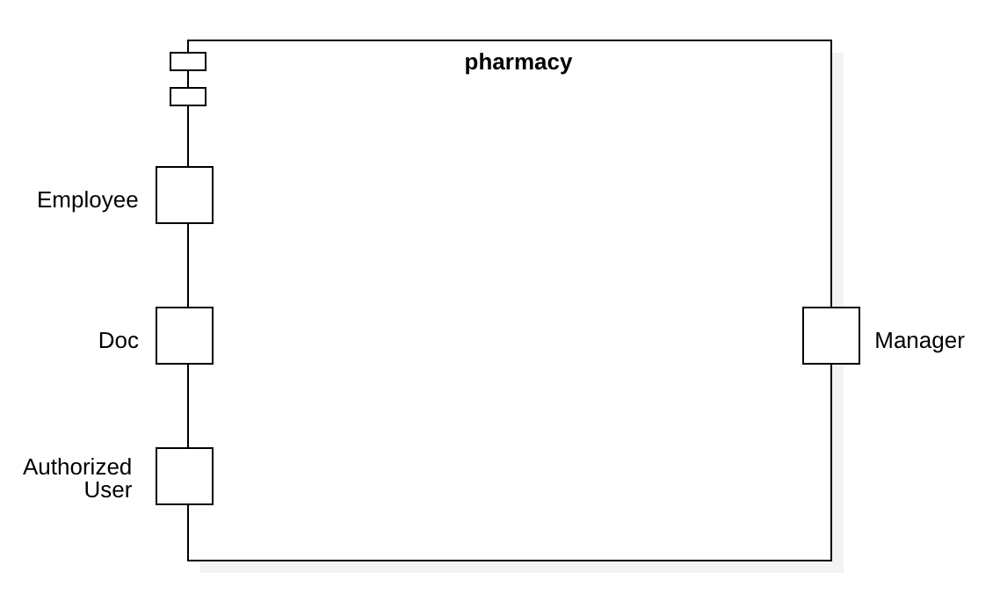
System Context Diagram

== Solution Strategy
=== Quality Demand Fulfillment
[options="header"]
|=== 
|Quality Demand |Solution approach
|Maintainability a|
- Recyclability: Components of the system should be reused by other components or systems.

- Modularity: Through discrete components, changes to one component should have less / no impact on other components.

- Modifiability: The aim is to ensure that the application can be changed or expanded without introducing errors or impairing product quality.

|Usability a|
- Learnability: The aim is to ensure that the system can be easily understood and used by its users.

- Accessibility: It must be guaranteed that a wide variety of people can use the system. Attention must be paid to inclusion (color contrasts, font sizes, easy language, ...).

- User interface aesthetics: Providing the user with the most pleasant possible interaction with the system.

- Error protection: The user of the system should not be able to make any mistakes that could cause the system to crash

|Security a|
- Integrity: It must be prevented that certain data in the system are changed without authorization.

- Confidentiality: It must be ensured that only authorized users can access certain data.

- Accountability: Actions and events must be traceable.

|===

=== Softwarearchitecture

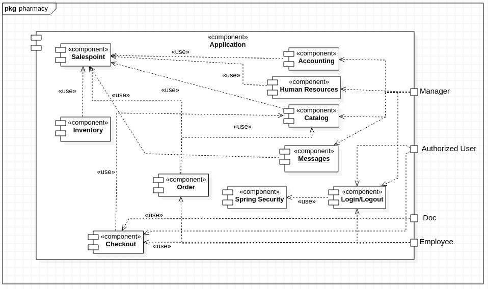

Top Level Architecture of the application

The software uses the Client Server Model. The client only contains HTML and CSS files. The application logic is implemented on the controller on server side.

Attention: JavaScript is compiled by the client. You can use JavaScript in your application but make sure, just make sure that you don't implement any application logic in it.

The HTML-Templates are rendered on the clients system with the matching CSS-Stylesheets. For the templates, we use Thymeleaf - which receives the requested data fom the controller classes. These are implemented in the backend. The controller classes use instances and methods of the model classes. The data is stored in an H2 database by default.

=== Architecture decisions
==== Design Pattern
* Spring MVC

==== Persistence
The application uses *Hibernate annotation based mapping* to map Java classes to database tables. As a database, *H2* is used.
The persistence is deactivated by default. To activate persistence storage, the following two lines in the file _application.properties_ have to be uncommented:
....
# spring.datasource.url=jdbc:h2:./db/pharmacy
# spring.jpa.hibernate.ddl-auto=update
....

==== User Interface

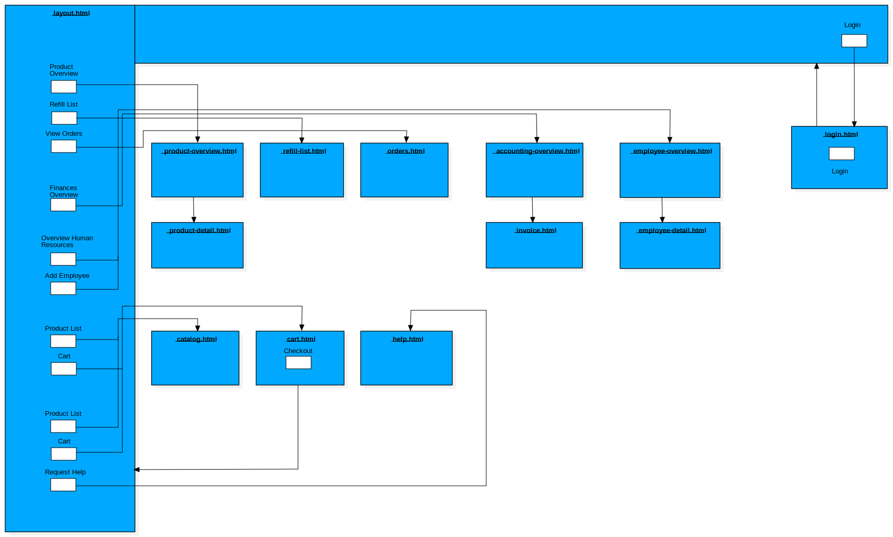
User Interface Diagram

_Note: The blue boxes display a HTML-Template. The white boxes within the templates represent buttons, which redirect to the templates, their outgoing arrows point to._

=== Use of external frameworks
[options="header", cols="1,2"]
|===
|External package |Used by (applications' class)
|salespointframework.catalog a|
* catalog.Article
* catalog.CatalogController
* checkout.CheckoutController
|salespointframework.core a|
* catalog.CatalogInitializer
* customer.CustomerDataInitializer
* inventory.InventoryInitializer
|salespointframework.inventory a|
* catalog.CatalogController
* inventory.InventoryController
* inventory.InventoryInitializer
* checkout.OrderController
* checkout.CheckoutController
|salespointframework.order a|
* checkout.CheckoutController
* checkout.OrderController
|salespointframework.payment a|
* checkout.OrderController
|salespointframework.quantity a|
* catalog.CatalogController
* inventory.InventoryInitializer
* checkout.CheckoutController
|salespointframework.SalespointSecurityConfiguration a|
* pharmacy.WebSecurityConfiguration
|salespointframework.security a|
* checkout.OrderController
* messages.MessagesController
|salespointframework.time a|
* catalog.CatalogController
|salespointframework.useraccount a|
* customer.Customer
* customer.CustomerDataInitializer
* customer.CustomerManagement
* checkout.CheckoutController

|springframework.data a|
* catalog.PharmacyCatalog
* customer.CustomerManagement
* customer.CustomerRepository
* messages.MessagesRepository
|springframework.security a| 
* pharmacyshop.WebSecurityConfiguration
|springframework.ui a|
* catalog.CatalogController
* customer.CustomerController
* inventory.InventoryController
* checkout.CheckoutController
* checkout.OrderController
* messages.MessagesController
|springframework.util a|
* customer.CustomerController
* customer.CustomerDataInitializer
* order.CheckoutController
* messages.MessagesController
|springframework.validation a|
* customer.CustomerController
|springframework.web a|
* checkout.CheckoutController
* checkout.OrderController
* messages.MessagesController
|springframework.stereotype a|
* checkout.OrderController
* checkout.CheckoutController
* messages.MessagesController
|javax.validation a|
* messages.MessagesController
* messsages.MessagesForm
|java.util a|
* checkout.OrderController
| javax.persistence a|
* messages.MessagesEntry
|===

== Building Block View

=== Pharmacy
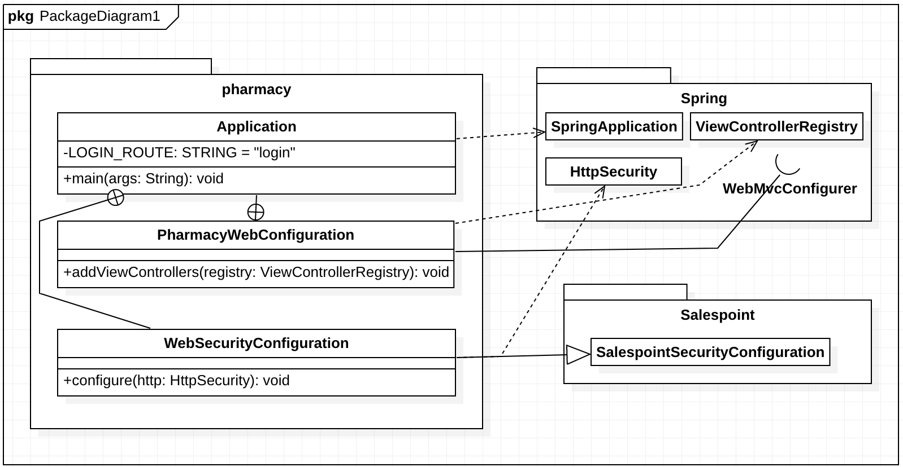
Pharmacy Building Block View Diagram

=== Checkout
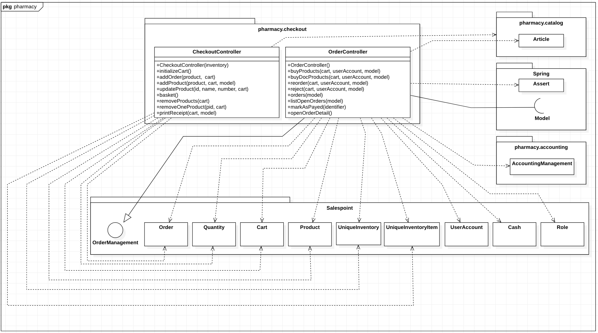
Checkout Building Block View Diagram

[options="header"]
|===
|Klasse/Enumeration |Description
|CheckoutController |Spring MVC controller to handle the cart and related actions (such as removing/adding products)
|OrderController |Handles anything related to the actual order after checkout.
|===

=== Messages
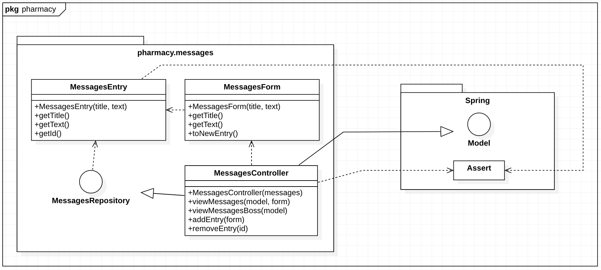
Messages Building Block View Diagram

[options="header"]
|===
|Klasse/Enumeration |Description
|MessagesController |Spring MVC controller to handle communication and requests from the HTML
|MessagesEntry |Service class handling message-related stuff
|MessagesForm |A form to validate input from the user
|MessagesRepository |A repository interface to manage messages
|===

=== Accounting
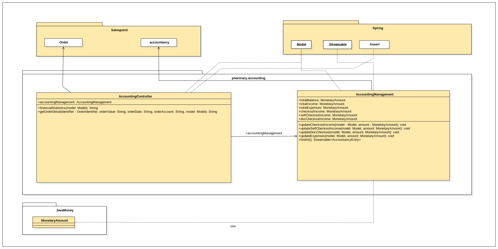
Accounting Building Block View Diagram

[options="header"]
|===
|Klasse/Enumeration |Description
|AccountingController|Handles everything between the HTML & Java
|AccountingManagement |Handles everything that is related to accounting
|===

=== Human Resources
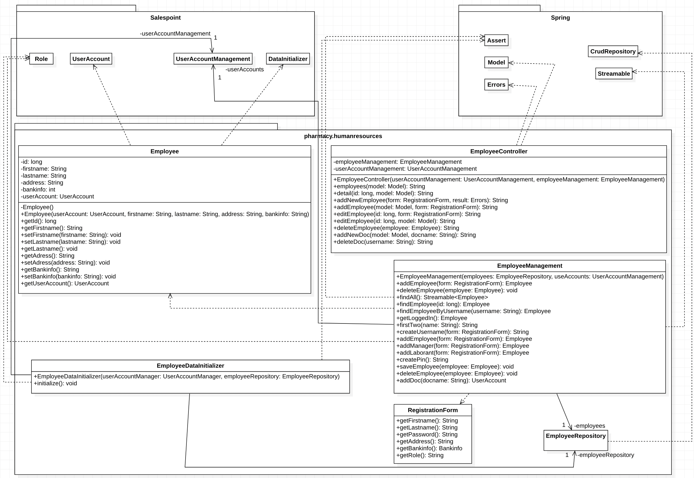
Human Resources Building Block View Diagram

[options="header"]
|=== 
|Class/Enumeration |Description
|Employee|Entity Employee includes a UserAccount and all other employee information saved in Human Resources
|EmployeeController|EmployeeController is used to manage the Post- and GetMapping for human resources
|EmployeeDataInitializer|EmployeeDataInitializer initializes the database so there are already some generic Users and Employees to work with
|EmployeeManagement|EmployeeManagement manages both the userAccount and employee databases
|EmployeeRepository|Repository for Employees
|RegistrationForm|RegistrationForm is used to contain all the information for Employee creation
|===

=== Catalog
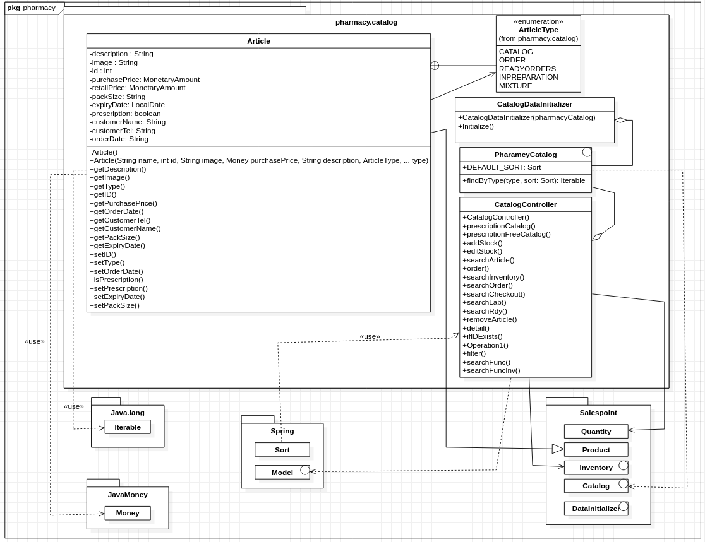
Catalog Building Block View Diagram

[options="header"]
|=== 
|Klasse/Enumeration |Description
|CatalogInitializer| DataInitializer to create pre-defined products on startup
|CatalogController| Spring MVC Controller to handle all requests related to editing the stock catalog
|Article| Class to describe the products of the pharmacy
|ArticleType| Enumeration to define a Article as CATALOG, ORDER, READYORDERS, INPREPARATION or MIXTURE item
|PharmacyCatalog|	Extension of Salespoint.Catalog to add specific queries
|===

=== Inventory
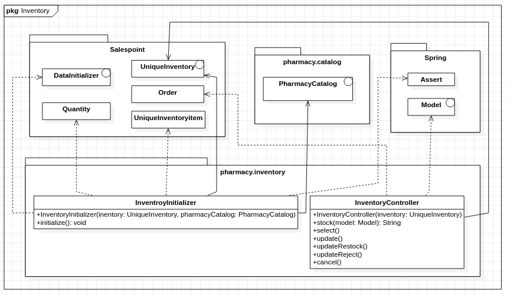
Inventory Building Block View Diagram

[options="header"]
|=== 
|Klasse/Enumeration |Description
|InventoryInitilalizer| DataInitializer to create pre-defined data on startup
|InventoryController  | Spring MVC Controller to handle all requests related to the stock
|===

=== Laboratory
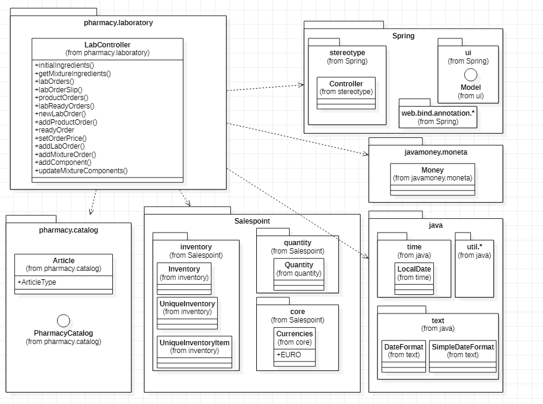
Laboratory Building Block View Diagram

[options="header"]
|===
|Klasse/Enumeration |Description
|LabController  | Spring MVC Controller to save mixture and medical orders in lab and control them.
|===

=== Traceability between Analysis- and Design Model
_Note: The following table shows the Forward- and Backward Traceability from the Analysis Model to the Design Model and vice versa. If an external class is used in the design model, the kind of usage of this external class is defined in the *Usage*-Column,
using one of the following options:_

* Inheritance/Interface-Implementation
* Class Attribute
* Method Parameter

[options="header"]
|===
|Class/Enumeration (Analysis Model) |Class/Enumeration (Design Model) |Usage
|Prescription                 a|
* catalog.Article
* catalog.ArticleType |
|Prescriptionfree                    a|
* catalog.Article
* catalog.ArticleType |
|ToOrder                    a|
* catalog.Article
* catalog.ArticleType |
|Lab                    a|
* catalog.Article
* catalog.ArticleType |
|Checkout                   |Salespoint.Cart | Method Parameter
|CartItem               |Salespoint.CartItem (via Salespoint.Cart) | Method Parameter (via Salespoint.Cart)
|ChargeLine             |Salespoint.ChargeLine (via Salespoint.Order) | Method Parameter (via Salespoint.Order)
|Stock              |Salespoint.UniqueInventory a|
* Class Attribute
* Method Parameter
|StockItem          |Salespoint.UniqueInventoryItem | Method Parameter
|Order                  |Salespoint.Order | Method Parameter
|OrderLine              |Salespoint.Orderline (via Salespoint.Order) | Method Parameter (via Salespoint.Order)
|OrderManager           |Salespoint.OrderManager<Order> a|
* Class Attribute
* Method Parameter
|OrderStatus            |Salespoint.OrderStatus | Method Parameter
|ROLE/Role              |Salespoint.Role | Method Parameter
|User                   a|
* Salespoint.UserAccount
* employee.Employee a|
* Class Attribute
* Method Parameter
|Pharmacy              |pharmacy.Application |
|===

== Runtime View
Representation of the component interaction by means of a sequence diagram showing the most relevant interactions.

=== Checkout
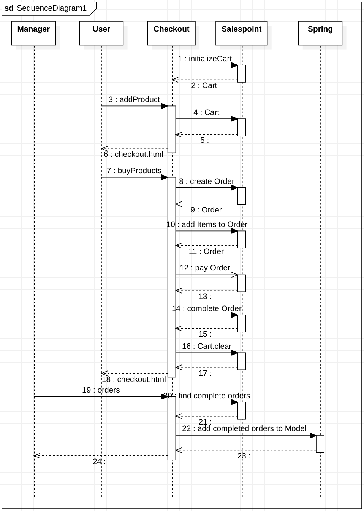
Checkout Runtime View Diagram

=== Accounting
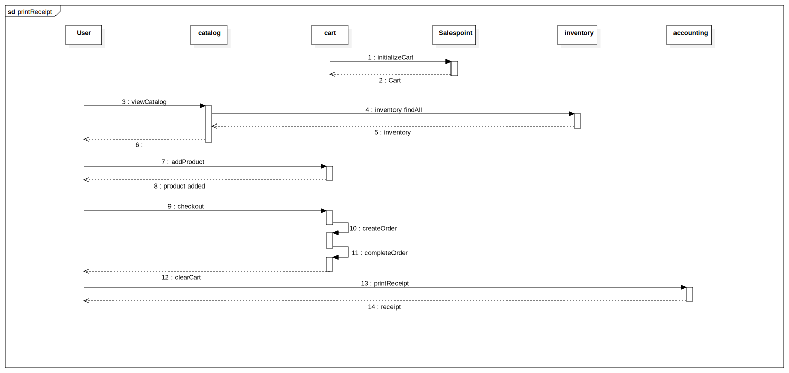
printReceipt Runtime View Diagram

=== Human Resources
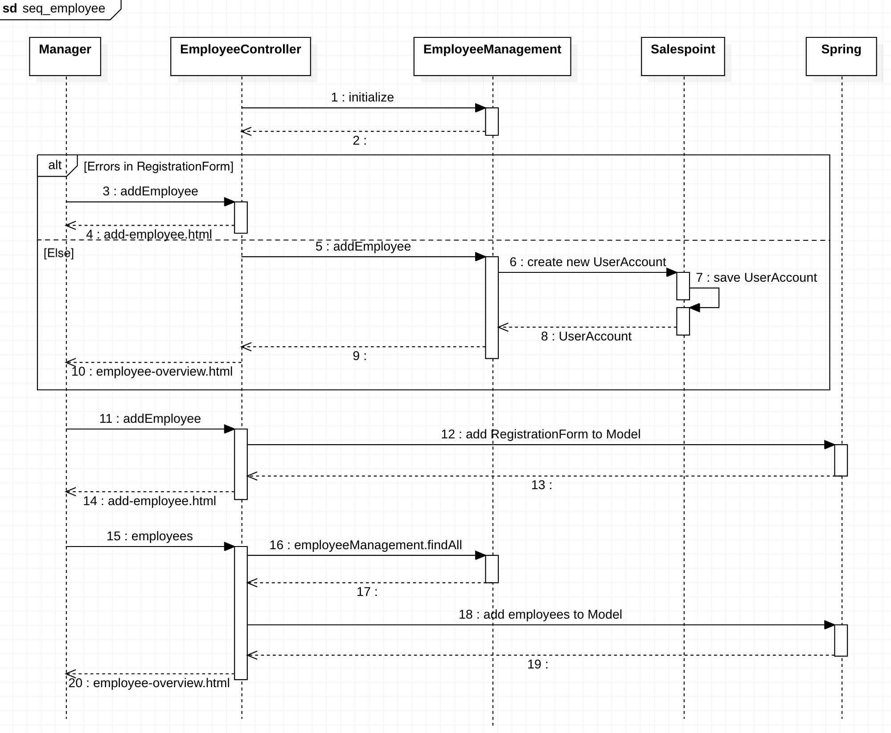
Human Resources Runtime View Diagram

=== Catalog
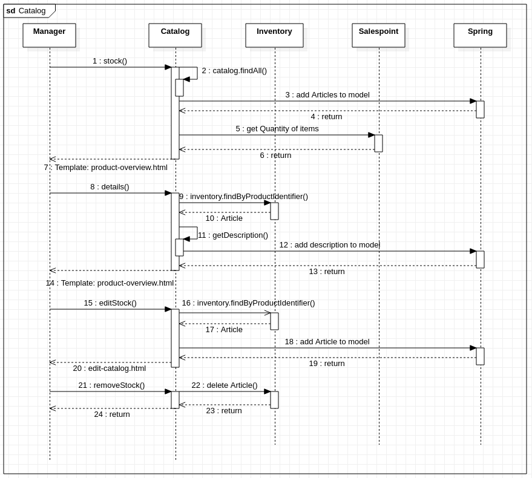

Catalog Runtime View Diagram

=== Laboratory
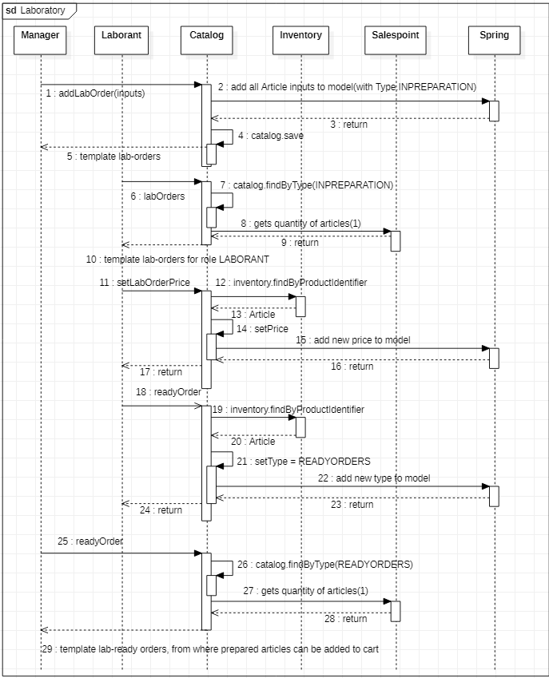

Laboratory Runtime View Diagram
