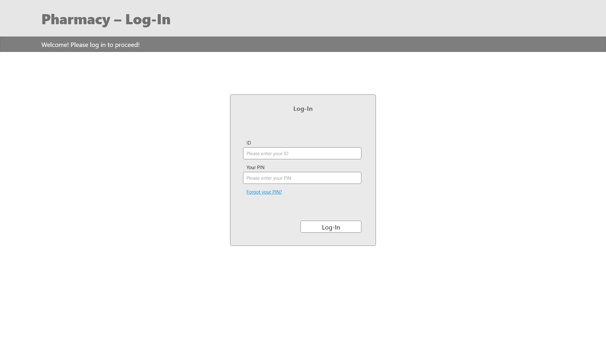
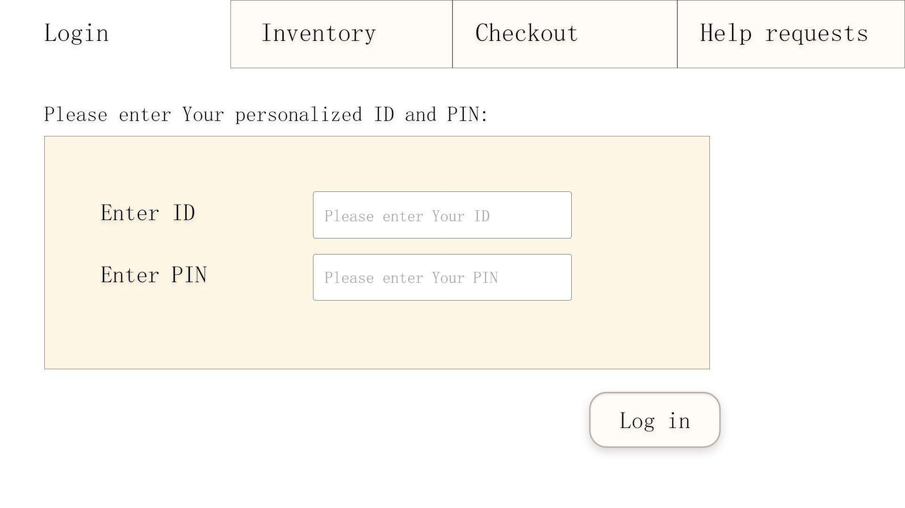

= Pflichtenheft
:project_name: Projektname
== __{project_name}__

[options="header"]
[cols="1, 1, 1, 1, 4"]
|===
|Version | Status      | Bearbeitungsdatum   | Autoren(en) |  Vermerk
|1.0    | Alpha Version  | 02.11.2021          | xxx | Initiale Version
|===

[[anchor1]]
== Table of contents

* <<anchor2, Purpose of this Document >>
* <<anchor3, Task Definition>>
* <<anchor4, Product usage>>
* <<anchor5, Stakeholders>>
* <<anchor6, System Boundaries and Component Structure>>
* <<anchor7, Use cases>>
* <<anchor8, Functional requirements>>
* <<anchor9, Non-functional requirements>>
* <<anchor10, GUI prototype>>
* <<anchor11, Data-model>>
* <<anchor12, Acceptance tests>>
* <<anchor13, Glossary>>

[[anchor2]]
== Purpose of this Document
This document is intended to give an overview of the software product to be developed for a pharmacy and serves as a basis for communication between those involved in the project, mainly the client and us, the development team. This document serves as the basis for a contract between clients and contractors. It describes what the desired system must fulfill and how the contractor wants to implement the solution.

[[anchor3]]
== Task Definition
A pharmacy will be added to the large Unterbrunn medical center. It is a salesroom with three cash registers and a self-service department for non-prescription goods (plasters, medicinal bath additives, healing teas of all kinds, care ointments, etc.). There is also a small chemical laboratory where special powders, ointments and tinctures can be prepared on request of the doctors (to be collected one day after ordering). When ordering mixtures or medicines not in stock, order receipts with a unique identification number are given out to the customers (the prescription remains in the pharmacy).

The pharmacy cabinets are sorted alphabetically as usual. Each medication package comes with with a bar code that uniquely identifies the medication and package size. When a drug is sold, the code is scanned at the cash register. This way, the item is included on the customer's invoice and at the same time added to the daily reorder.

Medicines are either paid for in cash, like other goods, or are sold to health insurance patients in return for a co-payment (10% of the price, with a minimum of EUR 5 and a maximum of EUR 10 per drug) The pharmacies settle the monthly invoices for the services provided by the central cash register on a monthly basis.

With the help of the new pharmacy, the doctor's offices also save themselves the management of their own medicine stocks: In addition to the pharmacy staff, the physicians and a few particularly reliable physician assistants also have access to the medicine cabinet at all times. For this purpose, there is a door to the pharmacy that can be opened from the medical center by entering a practice-specific PIN. On the other side of the door, a device scans the barcode of the medications taken when they leave. For the purpose of uniquely assigning medications and not disrupting pharmacy operations, no more than one doctor's office has access to the pharmacy at any one time. The physicians have stated that this is not a significant restriction. Billing to individual physician practices is done on a monthly basis.

All scanners are connected to the pharmacy's computer, which is used for automatic medication reordering, the pharmacy's own balance sheet, and billing to the substitute insurance companies. In addition to this, a weekly list of medications whose expiration date will be reached in the next week or which have already passed is printed out on this computer. These are sorted out on a weekly basis. 

The introduction of another service - the delivery of medicines to the nearby nursing home and other patients with limited mobility - is currently being being discussed.

Develop software that will appropriately support the operations outlined above (including personnel management) in an appropriate manner. Proposals for the design of the delivery service are also expected. 

[[anchor4]]
== Product usage

This section is an overview of how the product should be used after completion and under certain circumstances.

The system is used by a pharmacy to carry out all important processes. The software should run on a server and be available around the clock to the pharmacy (manager, employee, docs) via the Internet (via a browser).

The system should be accessible and optically optimized for the following browser:

- Mozilla Firefox, version 92.0.1+

- Google Chrome, version 94.0.4606+

The main users of the software are employees who mainly operate the cash register system, as well as administrators (managers) who take care of the processes running in the background, such as accounting. The software is also used by customers at the self-service checkouts, as well as the adjacent medical center, which has separate access. None of the software users require any special prior knowledge of the system. Only certain experience in dealing with computers should be assumed.

The system does not need any technical maintenance. All data should be permanently stored in a database and accessible via the application (e.g. no SQL knowledge should be required for a manager).

[[anchor5]]
== Stakeholders

[options="header", cols="2, ^1, 4, 4"]
|===
|Name
|Priority (1..5)
|Description
|Goals

|Costumers
|5
|Role who interact with the system or are operated by employees. Only role in the system, which is allowed to buy the content of the pharmacy.checkout cart.
a|
- good user experience
- easy to use system
- good service/ advice

|Employees
|4
|Role who mainly interact with the system to process orders. Only this role can be a registered user.
a|
- Good user experience
- easy to use system (clear system)

|Docs
|4
|People who have separate access to the pharmacy's stock and who can order special tinctures in the laboratory. Only this role can access security.
a|
- easy to use system

|Manager
|3
|Person who manages the processes in the pharmacy. Only this person has access to accounting and human resources.
a|
- Satisfy all roles as possible
- Profit maximization

|Developers
|2
|People who are either implementing the application or are responsible for maintenance later on.
a|
- Easily extendable application
- Low maintenance effort

|===

[[anchor6]]
== System Boundaries and Component Structure

=== System Context Diagram

=== Top-level architecture

[[anchor7]]
== Use-Cases

=== Actors
[options="header"]
[cols="1,4"]
|===
|Name |Description
|User              | Representative for every person, who interacts with the self pharmacy.checkout, regardless if authenticated or not.
|Authorized User    | Representative for every person, who does have an ID, PIN and interacts with the backdoor pharmacy.checkout
|Known Customer | Representative for a person with known information (name, adress, billing adress)
|Manager                 | Any registered (and authenticated) user, who has the Role "Manager". Is responsible for administration of the application.
|Employee            | Any registered (and authenticated) user, who has the Role "Employee". Is allowed to use pharmacy.checkout functions and certain functions in stock & lab.
|===

// See http://asciidoctor.org/docs/user-manual/#tables

=== Use-Case Diagram

=== Use-Case Descriptions

[cols="1h,3"]
[[UC0210]]
|===
|ID                         |**<<UC0100>>**
|Name                       |Add Product
|Description                |The employee or costumer should add a product to the cart and, if necessary, scan the prescription beforehand.
|Actors                     |Employee, Costumer
|Trigger                    |The customer wants to buy a product
|Precondition(s)            |-
|Essential Steps           a|
1. scan the prescription, if necessary
(2. check stock (with prescription))
3. scan the product barcode
|Extensions                 | -
|Functional Requirements    |**<<F0201>>**
|===

 

[cols="1h,3"]
[[UC0210]]
|===
|ID                         |**<<UC0101>>**
|Name                       |Buy Products
|Description                |The customer buys the desired products.
|Actors                     |Employee, Costumer
|Trigger                    |-
|Precondition(s)            |The products must be available
|Essential Steps           a|
1. pay the product(s)
2. receipt is created and printed automatically
3. update stock
|Extensions                 | -
|Functional Requirements    |**<<F0220>>**, **<<F0101>>**
|===

 

[cols="1h,3"]
[[UC0210]]
|===
|ID                         |**<<UC0102>>**
|Name                       |Remove Product
|Description                |It must be possible to remove products from the cart.
|Actors                     |Employee
|Trigger                    |The wrong product was added to the cart
|Precondition(s)            |A product has already been scanned and is in the shopping cart
|Essential Steps           a|
1. view the cart
2. click "Produkt entfernen"
3. remove product from the cart
|Extensions                 | -
|Functional Requirements    |**<<F0200>>**,**<<F01010>>**, **<<F0202>>**
|===

[cols="1h,3"]
[[UC0210]]
|===
|ID                         |**<<UC0103>>**
|Name                       |Check Stock
|Description                |The stock must be checked to see if this product is available
|Actors                     |Employee, Costumer
|Trigger                    |The customer wants a specific product
|Precondition(s)            |-
|Essential Steps           a|
1. search a product in the pharmacy.checkout system
2. click on the desired product
3. check how many of the products are in stock
|Extensions                 | -
|Functional Requirements    |**<<F0104>>**
|===

[cols="1h,3"]
[[UC0210]]
|===
|ID                         |**<<UC0104>>**
|Name                       |Order Product
|Description                |If a product is not available in sufficient quantities, it must be ordered.
|Actors                     |Employee
|Trigger                    |The customer wants a specific product
|Precondition(s)            |The product is not available
|Essential Steps           a|
1. search a product in the pharmacy.checkout system
2. order the desired product
|Extensions                 | -
|Functional Requirements    |**<<F0231>>**, **<<F0232>>**
|===

[cols="1h,3"]
[[UC0210]]
|===
|ID                         |**<<UC0106>>**
|Name                       |Clock In
|Description                |In order to track working hours and get access to the cash register system, employees must clock in at the start of work.
|Actors                     |Employee
|Trigger                    |The employee comes to work
|Precondition(s)            |The employee must have an ID
|Essential Steps           a|
1. The employee comes to work → Clock In
|Extensions                 | -
|Functional Requirements    |**<<F0010>>**
|===

[cols="1h,3"]
[[UC0210]]
|===
|ID                         |**<<UC0107>>**
|Name                       |Clock Out
|Description               a|
To keep track of working hours and terminate access to the pharmacy.checkout system, employees must clock out at the end of work.
|Actors                     |Employee
|Trigger                    |The employee comes to go home
|Precondition(s)            |The employee must have an ID
|Essential Steps           a|
1. The employee is finishing work → Clock Out
|Extensions                 | -
|Functional Requirements    |**<<F0010>>**
|===

[cols="1h,3"]
[[UC0210]]
|===
|ID                         |**<<UC0108>>**
|Name                       |Send HelpRequest
|Description               a|
If customer has a problem with self-service pharmacy.checkout or wants to remove any product he already scanned from his cart, he is able send a help request to employee.
|Actors                     |Customer, Employee
|Trigger                    |Customer needs help with self-service pharmacy.checkout
|Precondition(s)            |Customer started to interact with self-service pharmacy.checkout system
|Essential Steps           a|
1. Customer presses button "Help" or button "remove" next to already scanned product
2.	Request is being sent to pharmacy.checkout
3.	Request was noticed by employee
4.	Employee clicked "help" button accepting the request
5.	Employee is there to help customer with self-service System

|Extensions                 | -
|Functional Requirements    | -
|===

[cols="1h,3"]
[[UC0210]]
|===
|ID                         |**<<UC0300>>**
|Name                       |Order Item
|Description                |An employee shall be able to order a product, which will take some time to be prepared.
|Actors                     |Employee
|Trigger                    |Employee wants to order an item.
|Precondition(s)            |The employee is logged in.
|Essential Steps           a|
1.	Employee accesses Tab „Lab”
2.	Employee presses button “Order Item”
3.	Employee enters the name of the product they wish to order and the quantity
4.	Employee enters the customer's name and email-address so that the customer can be notified when the product is ready
5.	Employee presses button "Order now"
6.	The order is given a unique id and added to a list of ordered products
7.	The receipt for the current order containing the unique ID for the order is printed 
|Extensions                 | -
|Functional Requirements    |**<<F0220>>** **<<F0230>>** **<<F0231>>**
|===

[cols="1h,3"]
[[UC0210]]
|===
|ID                         |**<<UC0301>>**
|Name                       |Prepare Item
|Description                |An employee shall be able to prepare an ordered product and the customer shall be notified that it is now ready for pickup.
|Actors                     |Employee
|Trigger                    |Employee wants to prepare an item and notify the customer.
|Precondition(s)            |The employee is logged in.
|Essential Steps           a|
1.	Employee accesses Tab „Lab”
2.	Employee accesses the list of orders
3.	Employee chooses the product they wish to prepare
4.	Employee presses button "Item is ready"
5.	The product is placed in the stock with the label "reserved" and the unique id
6.	An email is sent to the customer notifying them that their order is ready
|Extensions                 | -
|Functional Requirements    |**<<F0100>>** **<<F0102>>** **<<F0230>>** **<<F0232>>**
|===

[cols="1h,3"]
[[UC0210]]
|===
|ID                         |**<<UC0302>>**
|Name                       |Pick Up Item
|Description                |An employee shall be able to pick up an ordered product with the correct unique id within 24 hours of the order being placed.
|Actors                     |Employee
|Trigger                    |Employee wants to pick up a specific ordered item.
|Precondition(s)            |The employee is logged in.
|Essential Steps           a|
1.	Employee accesses Tab „Labor”
2.	Employee presses button „Bestellte Ware abholen”
3.	Employee enters the unique id from the receipt
  . If the ID is correct (is in the list of ordered items) and is ready: Employee can press button "Jetzt abholen" 
    - Employee presses button „Jetzt abholen”
    - The product is placed in the cart 
    - The correct quantity of product should be deleted from the stock along with the unique id
  . If the ID is correct (is in the list of ordered items), but is not ready yet: A message is shown telling the employee how much longer they must wait
  . Otherwise if the ID is not correct (is not in the list of ordered items): An error message is shown
|Extensions                 | -
|Functional Requirements    |**<<F0100>>** **<<F0101>>** **<<F0200>>** **<<F0201>>** **<<F0230>>**
|===

 

[cols="1h,3"]
[[UC0210]]
|===
|ID                         |**<<UC0401>>**
|Name                       |Register User
|Description                |Authorizing a user for backdoor pharmacy.checkout access
|Actors                     |Manager
|Trigger                    |Manager registers a new customer
|Precondition(s)            |Customer hasnt been added yet 
|Essential Steps           a|
1.	Actor with "Manager" role accesses tab "Database" in System
2.	Manager acesses "registerUser"
3.	Manager enters necessary information
4.	An new authorized user is created with his own set of automatically generated ID and PIN
|Extensions                 | -
|Functional Requirements    | **<<F0010>>**
|===

[cols="1h,3"]
[[UC0210]]
|===
|ID                         |**<<UC0402>>**
|Name                       |Edit Roster
|Description                |Editing the work roster
|Actors                     |Manager
|Trigger                    |Manager edits the roster
|Precondition(s)            |-
|Essential Steps           a|
1.	Actor with "Manager" role accesses tab "Database" in System
2.	Manager acesses "editRoster"
3.	Manager enters necessary information and confirms the changes
4.	The roster will be updated 
|Extensions                 | -
|Functional Requirements    | **<<F0010>>** 
|===

[cols="1h,3"]
[[UC0210]]
|===
|ID                         |**<<UC0501>>**
|Name                       |Add stock
|Description                |Adding items to stock
|Actors                     |Employees
|Trigger                    |Employee adding stock
|Precondition(s)            |Stock has been ordered through "refillStock", the employee is logged in.
|Essential Steps           a|
1.    Actor with "Employee" role navigates to "addStock" in System
2.    Employee scans item ID
3.    System adds items to "Stock" and confirms the appropriate position of the Items (sortStock)

|Extensions                 | -
|Functional Requirements    | **<<F0010>>** **<<F0100>>** **<<F0102>>** **<<F0103>>** **<<F0105>>**
|===

[cols="1h,3"]
[[UC0210]]
|===
|ID                         |**<<UC0502>>**
|Name                       |Stock clearance
|Description                |Removing items from stock that either will or already have expired
|Actors                     |Employees
|Trigger                    |Weekly disposal of expired products
|Precondition(s)            |Checked expiration date (list)
|Essential Steps           a|
1.    System checked expiration dates a week prior and printed a list of items that are to be disposed of
2.    Actor with role "Employee" removes the necessary items according to the list
3.    Employee confirms that items have been removed from stock in System

|Extensions                 | -
|Functional Requirements    | **<<F0010>>** **<<F0100>>** **<<F0101>>** **<<F0110>>**
|===

[cols="1h,3"]
[[UC0210]]
|===
|ID                         |**<<UC0503>>**
|Name                       |Add new product
|Description                |Adding new product to the catalogue
|Actors                     |Manager
|Trigger                    |-
|Precondition(s)            |User has role "Manager"
|Essential Steps           a|
1.    Actor with role "Manager" access "stock options" in System
2.    Manager can add a new product by providing the necessary details
3.    Manager saves (confirms) changes

|Extensions                 | -
|Functional Requirements    | **<<F0010>>** **<<F0100>>**
|===

 

[cols="1h,3"]
[[UC0210]]
|===
|ID                         |**<<UC0504>>**
|Name                       |Update product
|Description                |Changing Product Details (info, amount, etc.) in the stock catalogue
|Actors                     |Manager
|Trigger                    |-
|Precondition(s)            |User has role "Manager", product already available in stock catalogue
|Essential Steps           a|
1.    Actor with role "Manager" access "stock options" in System
2.    Manager can update Product details or quantity
3.    Manager saves (confirms) changes

|Extensions                 | -
|Functional Requirements    | **<<F0010>>** **<<F0100>>**
|===

[cols="1h,3"]
[[UC0210]]
|===
|ID                         |**<<UC0505>>**
|Name                       |Remove product
|Description                |Removing a product from stock catalogue
|Actors                     |Manager
|Trigger                    |-
|Precondition(s)            |User has role "Manager", product already available in stock catalogue
|Essential Steps           a|
1.    Actor with role "Manager" access "stock options" in System
2.    Manager can delete a Product from stock catalogue
3.    Manager saves (confirms) changes

|Extensions                 | -
|Functional Requirements    | **<<F0010>>** **<<F0100>>**
|===

 

[cols="1h,3"]
[[UC0210]]
|===
|ID                         |**<<UC0600>>**
|Name                       |Show Total Balance
|Description                |Calculates and shows the total balance of the system.
|Actors                     |Manager
|Trigger                    |Manager accesses the balance overview.
|Precondition(s)            |-
|Essential Steps           a|
1.    Actor presses "Accounting" in the navigation
2.    System calculates the total balance and then displays it.
|Extensions                 |Could be extended with an overview diagram showing the payments in different categories (income, employee-payments, restock) from last month.
|Functional Requirements    | **<<F0400>>**
|===

[cols="1h,3"]
[[UC0210]]
|===
|ID                         |**<<UC0601>>**
|Name                       |Bill Doctors
|Description                |Calculates and sends a monthly invoice for each doctor. (Assumes that bills are payed instant for simplification.)
|Actors                     |
|Trigger                    |A certain date (for example on the 28th each month).
|Precondition(s)            |-
|Essential Steps           a|
1.    System calculates the current invoice for the doctor (and then sends it using email for example).

|Extensions                 | -
|Functional Requirements    | **<<F00100>>**
|===

[cols="1h,3"]
[[UC0210]]
|===
|ID                         |**<<UC0602>>**
|Name                       |Bill Customer Delivery
|Description                |Calculates and generates a monthly invoice for what a certain customer has ordered via delivery. (Assumes that bills are payed instant for simplification.)
|Actors                     |
|Trigger                    |A certain date (for example on the 28th each month).
|Precondition(s)            |-
|Essential Steps           a|
1.    System calculates the current invoice for a customer (and then sends it using email for example).
|Extensions                 | -
|Functional Requirements    | **<<F0400>>**
|===

[cols="1h,3"]
[[UC0210]]
|===
|ID                         |**<<UC0603>>**
|Name                       |Bill Insurance
|Description                |Calculates and generates a monthly invoice based on what customers have bought (there's a 10%/max 10€ rule in Germany which determines how much a customer has to pay for his products on which this method is based).
|Actors                     |
|Trigger                    |A certain date (for example on the 28th each month).
|Precondition(s)            |-
|Essential Steps           a|
1.    System calculates the current invoice for the Insurance.
|Extensions                 | -
|Functional Requirements    | **<<F0232>>**
|===

[cols="1h,3"]
[[UC0210]]
|===
|ID                         |**<<UC0604>>**
|Name                       |Pay the Supplier(s)
|Description                |Calculates and generates a (monthly)? payment for the goods that were delivered to the pharmacy.
|Actors                     |
|Trigger                    |A certain date (for example on the 28th each month).
|Precondition(s)            |-
|Essential Steps           a|
1.    System calculates the figure that the pharmacy needs to pay to the supplier.
|Extensions                 | -
|Functional Requirements    | **<<F0400>>**
|===

[cols="1h,3"]
[[UC0210]]
|===
|ID                         |**<<UC0605>>**
|Name                       |Pay Employee(s)
|Description                |Calculates how many hours an employee had in the past month and then generates the salary for each employee. Get's its data from the clock-in and clock-out methods in pharmacy.checkout.
|Actors                     |
|Trigger                    |A certain date (for example on the 28th each month).
|Precondition(s)            |-
|Essential Steps           a|
1.    System calculates how many hours an employee had worked the past month and then calculates the salary.
|Extensions                 | -
|Functional Requirements    | **<<F0010>>** **<<F0300>>** **<<F0301>>**
|===

[cols="1h,3"]
[[UC0210]]
|===
|ID                         |**<<UC0700>>**
|Name                       |Add Employee
|Description                |A manager shall be able to add an employee.
|Actors                     |Manager
|Trigger                    |Manager wants to add an employee.
|Precondition(s)            |The Manager must be logged in.
|Essential Steps           a|
1.	Manager accesses tab "human resources"
2.	Manager presses button "add new employee"
3.	He enters the personal information of the new employee (name, surname, address, bank information)
4.	An new employee is created with his own set of automatically generated clock-in-information
|Extensions                 | -
|Functional Requirements    |**<<F0020>>**
|===

[cols="1h,3"]
[[UC0210]]
|===
|ID                         |**<<UC0701>>**
|Name                       |Delete Employee
|Description                |A manager shall be able to delete an employee.
|Actors                     |Manager
|Trigger                    |Manager wants to delete an employee.
|Precondition(s)            |The Manager must be logged in and the employee must already exist.
|Essential Steps           a|
1.	Manager accesses tab "human resources"
2.	Manager presses button "delete employee"
3.	He is shown a list of all current employees
4.	He chooses the employee he wants to delete
5.	He is shown a message "are you sure you want to delete this employee?" 
6.	He confirms his decision
7.	The chosen employee is deleted from the system
|Extensions                 | -
|Functional Requirements    | -
|===

[cols="1h,3"]
[[UC0210]]
|===
|ID                         |**<<UC0702>>**
|Name                       |Edit Employee
|Description                |A manager shall be able to edit the personal information of an employee.
|Actors                     |Manager
|Trigger                    |Manager wants to edit the personal information of an employee.
|Precondition(s)            |The Manager must be logged in and the employee must already exist.
|Essential Steps           a|
1.	Manager accesses tab "human resources"
2.	Manager presses button "edit employee"
3.	He is shown a list of all current employees
4.	He chooses the employee he wants to edit
5.	He edits everything he wants to
6. He presses "save" to confirm his alterations
|Extensions                 | -
|Functional Requirements    | -
|===

[cols="1h,3"]
[[UC0210]]
|===
|ID                         |**<<UC0800>>**
|Name                       |Check In
|Description                |PIN check for a doctor entering the pharmacy through the back door with a specific PIN number, allowing the system to track who entered the pharmacy. Checks if a person is already in as well, as only one doc can be in.
|Actors                     |Docs
|Trigger                    |A Doc entering a PIN on the back door.
|Precondition(s)            |No doctor is in the pharmacy right now.
|Essential Steps           a|
1.    Doc enters a specific PIN on the back door of the pharmacy.
2.    The system checks if the PIN is valid and that there isn't another doc already in the pharmacy. If so, the system openes the door.
|Extensions                 | Could be extended with an alarm system that goes off after entering a wrong PIN three times in a row.
|Functional Requirements    | -
|===

[cols="1h,3"]
[[UC0210]]
|===
|ID                         |**<<UC0801>>**
|Name                       |Check Out
|Description                |The other side of the back door has a barcode scanner for the Docs, where they need to scan all the articles that they've take away from the pharmacy stock to refill these and bill the docs.
|Actors                     |Docs
|Trigger                    |A doc scanning products on the barcode scanner at the back door.
|Precondition(s)            |Doc is in the pharmacy.
|Essential Steps           a|
1.    Docs scans all the articles they've taken from the pharmacy.
|Extensions                 |
|Functional Requirements    | **<<F0400>>**
|===

[[anchor8]]
== Functional Requirements

=== Must have criteria

[options="header", cols="2h, 1, 3, 12"]
|===
|ID
|Version
|Name
|Description

|[[F0010]]<<F0010>>
|v0.1
|Authentication
a|
The system shall be able to be separated into publicly accessible parts, and parts which
require authentication to be accessed. If a User is existent in the system he or she shall be able to authenticate by providing information

|[[F0100]]<<F0100>>
|v0.1
|Stock
a|
System which stores information about what and how many of these items are in stock.

|[[F0101]]<<F0101>>
|v0.1
|Reduce Stock
a|
The system shall be able to reduce the amount of a product in the stock.

|[[F0102]]<<F0102>>
|v0.1
|Add Stock
a|
The system shall be able to increase the amount of a product in the stock.

|[[F0103]]<<F0103>>
|v0.1
|Restock
a|
The system shall be able to calculate and order missing products from the stock.

|[[F0104]]<<F0104>>
|v0.1
|Check Stock
a|
The system shall provide a User the ability to search for an item (+ product details) and check the quantity.

|[[F0105]]<<F0105>>
|v0.1
|Sort Stock
a|
The system shall sort the medicine cabinet alphabetically.

|[[F0110]]<<F0110>>
|v0.1
|Check for expiration date
a|
The system shall check for expired products in stock (these will be removed by an employee).

|[[F0200]]<<F0200>>
|v0.1
|Cart
a|
The system shall provide every user with a cart, in which he can temporarily store scanned products.

|[[F0201]]<<F0201>>
|v0.1
|Add Product to Cart
a|
The system shall allow a Customer or an Employee to ability to add a product to his cart in the desired quantity.

Only employees are allowed to add a prescription only product.

|[[F0202]]<<F0202>>
|v0.1
|Remove Product from Cart
a|
The system shall allow a Customer or an Employee to ability to remove an already scanned product from his cart in the desired quantity.

|[[F0210]]<<F0210>>
|v0.1
|Buy Products in Cart
a|
The system shall provide a user (Employee or Customer at the self-pharmacy.checkout) with the ability to buy the content of the cart.

|[[F0220]]<<F0220>>
|v0.1
|Print Receipt
a|
The system shall provide a user (Employee or Customer at the self-pharmacy.checkout) with the ability to print the receipt after the products from the cart have been purchased.

|[[F0230]]<<F0230>>
|v0.1
|Orders
a|
The system shall be able to persistently store orders for products which are not in stock or created on demand (lab).

|[[F0231]]<<F0231>>
|v0.1
|Create Order
a|
The system shall be able to create an order.

An order shall be initialized with the status "OPEN".

|[[F0232]]<<F0232>>
|v0.1
|Complete Order
a|
The system shall be able to complete an order once the product is ready/back in store.

An order is completed by setting its status to "COMPLETED".

|[[F0300]]<<F0300>>
|v0.1
|Employee
a|
The system shall provide a system to store all employees.

|[[F0301]]<<F0301>>
|v0.1
|Add Employee
a|
The system shall provide a manager the ability to add a new employee.

The following information has to be provided:

* Name
* Surname
* Address
* Bank Information
* Social Security Number

|[[F0302]]<<F0302>>
|v0.1
|Remove Employee
a|
The system shall provide a manager the ability to remove an employee.

|[[F0303]]<<F0303>>
|v0.1
|View Employee List
a|
The system shall provide a manager the functionality to view all employees (and their details).

|[[F0303]]<<F0304>>
|v0.1
|Edit Employee
a|
The system shall provide a manager the ability to edit the personal information of an employee.

|[[F0400]]<<F0400>>
|v0.1
|Accounting
a|
The system shall provide a system to process (and create) the bills and payments and then calculate the current balance.

|===

=== Can have criteria

[options="header", cols="2h, 1, 3, 12"]
|===
|ID
|Version
|Name
|Description

|[[Fx01]]<<F0x01>>
|v0.1
|Discount
a|
The manager shall be able to be able to add a discount to certain products.

|[[Fx02]]<<F0x02>>
|v0.1
|Show statistics
a|
The manager shall be able to view statistics in the system.

|[[Fx03]]<<F0x03>>
|v0.1
|Edit rooster
a|
The manager shall be able to edit a work rooster in system.

|[[Fx04]]<<F0x04>>
|v0.1
|Sent email
a|
The system shall be able to automatically sent emails (in general).

|===

[[anchor9]]
== Non-Functional Requirements

=== Quality Demands

1 = Not Important ..
5 = Very Important
[options="header", cols="3h, ^1, ^1, ^1, ^1, ^1"]
|===
|Quality Demand           | 1 | 2 | 3 | 4 | 5
|Maintainability          |   |   | x |   |
|Usability                |   |   |   | x | 
|Security                 |   |   |   |   | x
|===

=== Concrete NF Requirements

[[anchor10]]
== GUI Prototype

Find a working draft of the UI for the admin-backend here: https://xd.adobe.com/view/88f69c8e-9d3f-4a82-8c86-aee383a4c08b-dda5/

Image 1: Log-In
 

Image 2: Admin Backend
 

Image 3: Product
 

Image 4: Product Overview
 

Image 5: Add Product
 

Image 6: Add/Remove Quantity
 

Image 7: Finances Overview
image:models/design/Finances.jpg[gui prototyp] 

Image 8: Invoice Detail View
 

Image 9: Human Resources Overview
 

Image 10: Overview Employee
image:models/design/Overview Employee.jpg[gui prototyp] 

Image 11: Add Employee
 

Image 12: StartSelfService
 

Image 13: SelfServiceEmptyCart
 

Image 14: SelfServiceCart 

Image15:SelfServiceCartEmployeeRemoveRequest

Image 16: CheckoutSystemLogin

Image 17: Checkout System LoggedIn

Image 18: Checkout System Checkout

Image 19: Checkout System Inventory

Image 20: Checkout System Inventory Details

Image 21: Checkout Help Requests

Find a working draft of the UI for the self-pharmacy.checkout here: https://xd.adobe.com/view/e3982886-f09a-4646-9a68-84bd42362d48-b6cb/
Find a working draft of the UI for the pharmacy.checkout system here: https://xd.adobe.com/view/1864abac-8eb1-4152-b313-afbbb133ceec-4d37/

[[anchor11]]
== Data Model

=== Class Diagram

=== Classes and Enumerations
The following table gives an overview of the classes/enumerations used in the domain model.
Therefore, this section is a subset of the <<Glossary, glossary>> and shall be used to provide every stakeholder a common understanding of central terms and concepts of the domain of the system.

// See http://asciidoctor.org/docs/user-manual/#tables
[options="header", cols="1h,4"]
[[classes_enumerations]]
|===
|Class/Enumeration |Description 
|Pharmacy              |Central class of the system representing the pharmacy itself.
|Checkout             |Point of sales and orders managed by an employee
|SelfCheckout              |Point of sales for customers without an employees interaction
|Stock             |Database of all available items and semi-automatic managment   
|STOCKTYPE              |Type of an stockitem 
|Product             |Stockitem data
|StockItem              |Quantity of a stockitem
|Order             |An order of items from a known customer created by an employee at the pharmacy.checkout
|STATUS              |This status represents the current processing step of the order it belongs to.  
|Customer              |General representation of a real person   
|KnownCustomer             |A customer with known information
|AuthorizedUser              |A customer with access to the backdoor pharmacy.checkout
|BackdoorCheckout              |A pharmacy.checkout for authorized customers
|STATUS              |Status about the availability of the backdoor pharmacy.checkout
|Lab              |Laboratory in which certain ordered items can be created
|Employee              |A representation of a real working person     
|Manager              |An employee that manages the pharmacy and has access to certain functionalities through the system
|System             |Central control and access to certain functionalities
|Accounting              |Financial managment
|Database           |General managment (Information about, employees, customers, stats, etc.)
|HumanResources             |Workforce managment

|===

[[anchor12]]
== Acceptance Testing

:Pre: Precondition(s)
:Event: Event
:Result: Expected Result

[cols="1h, 4"]
|===
|ID            |<<AT0100>>
|Use Case      |<<UC0100>>
|{Pre}        a|
|{Event}      a|An employee or a customer adds 2 packets of Aspirin to the cart.
|{Result}     a|
- There should now be 2 more packets of Aspirin in the cart than before
|===

[cols="1h, 4"]
|===
|ID            |<<AT0101>>
|Use Case      |<<UC0101>>
|{Pre}        a|The cart isn't empty.
|{Event}      a|The entire content of the cart is bought.
|{Result}     a|
- A receipt is printed containing the information of the purchase
- For a few moments, a message is shown: "Danke für Ihren Einkauf!"
- Then the page switches to a now empty cart, ready for the next customer
|===

[cols="1h, 4"]
|===
|ID            |<<AT0102>>
|Use Case      |<<UC0102>>
|{Pre}        a|The cart contains more than one packet of Aspirin.
|{Event}      a|One packet of Aspirin is removed from the cart.
|{Result}     a|
- There should now be one less packet of Aspirin in the cart than before
|===

[cols="1h, 4"]
|===
|ID            |<<AT0103>>
|Use Case      |<<UC0103>>
|{Pre}        a|-
|{Event}      a|An employee checks the stock for Aspirin.
|{Result}     a|
- The employee should now be able to see how many packets of Aspirin are in stock right now
|===

[cols="1h, 4"]
|===
|ID            |<<AT0104>>
|Use Case      |<<UC0104>>
|{Pre}        a|-
|{Event}      a|An employee orders 50 packets of Aspirin.
|{Result}     a|
- An order for 50 packets of Aspirin should now have been placed. 
|===

[cols="1h, 4"]
|===
|ID            |<<AT0106>>
|Use Case      |<<UC0106>>
|{Pre}        a|The employee must be registered and have login information.
|{Event}      a|An employee enters his correct login information.
|{Result}     a|
- The employee should now have access to the cash register
- The time of clocking in should be saved in order to track his working hours
|===

[cols="1h, 4"]
|===
|ID            |<<AT0107>>
|Use Case      |<<UC0107>>
|{Pre}        a|The employee must be clocked in.
|{Event}      a|An employee clicks on "Clock out".
|{Result}     a|
- The employee should no longer have access to the cash register
- The screen should show a page asking for login information
- The time of clocking out should be saved in order to track his working hours
|===

[cols="1h, 4"]
|===
|ID            |<<AT0300>>
|Use Case      |<<UC0300>>
|{Pre}        a|
|{Event}      a|An employee orders an ointment in the lab by choosing it from a list of products.
|{Result}     a|
- The correct amount of the item should be in a list of ordered items
- A receipt containing the unique id should be printed
|===

[cols="1h, 4"]
|===
|ID            |<<AT0301>>
|Use Case      |<<UC0301>>
|{Pre}        a|The ointment was ordered.
|{Event}      a|An employee prepares an ointment in the lab and sets the status of the order to "Item is ready".
|{Result}     a|
- The product should now be in the stock with the label "reserved" and the unique id
- An email should be sent to the customer notifying them that their order is ready
|===

[cols="1h, 4"]
|===
|ID            |<<AT0302>>
|Use Case      |<<UC0302>>
|{Pre}        a|The ointment was ordered and prepared.
|{Event}      a|A customer wants to pick up the item from the lab and the employee enters the correct ID from their receipt.
|{Result}     a|
- The product should now be in the cart
- The correct quantity of product should be deleted from the stock along with the unique ID
- The ID should be deleted from the list of orders
|===

[cols="1h, 4"]
|===
|ID            |<<AT0501>>
|Use Case      |<<UC0501>>
|{Pre}        a|Stock has been ordered through "refillStock", the employee is logged in.
|{Event}      a| An employee adds 50 packets of Aspirin to the stock.
|{Result}     a|- There should now be 50 more packets of Aspirin in the stock than before 
- They should be shown in the correct alphabetical order in the stock
|===

[cols="1h, 4"]
|===
|ID            |<<AT0502>>
|Use Case      |<<UC0502>>
|{Pre}        a|The employee is logged in.
|{Event}      a| An employee removes 50 packets of Aspirin from the stock.
|{Result}     a|
- There should now be 50 less packets of Aspirin in the stock than before 
|===

[cols="1h, 4"]
|===
|ID            |<<AT0503>>
|Use Case      |<<UC0503>>
|{Pre}        a|The manager is logged in.
|{Event}      a| A manager adds a new product by entering the following information:
- Name: Paracetamol
- Packet size: 20 tablets
- Product number: 12475286
- prescription-free
- Price: 1,39€
|{Result}     a|
- The product “Paracetamol” should now be in the list of products 
|===

[cols="1h, 4"]
|===
|ID            |<<AT0504>>
|Use Case      |<<UC0504>>
|{Pre}        a|The manager is logged in, the product “Paracetamol” exists.
|{Event}      a| A manager edits product “Paracetamol” by choosing it in the list of products and entering the following information:
- Price: 1,59€
|{Result}     a|
- The price of Paracetamol should now be 1,59€
|===

[cols="1h, 4"]
|===
|ID            |<<AT0700>>
|Use Case      |<<UC0700>>
|{Pre}        a|A manager is logged in.
|{Event}      a|A manager adds a new employee by entering their personal information:
- Name: Max Mustermann
- Address: Nöthnitzer Straße 46
- IBAN: DE25 8504 0000 0800 4004 01
- Role: Employee
- Salary: 3.463,00 Euro
|{Result}     a|
- The employee should now be registered in the system
- The employee should now have login information with which they can clock in at the register
- The employee should now be paid at the end of the month
|===

[cols="1h, 4"]
|===
|ID            |<<AT0701>>
|Use Case      |<<UC0701>>
|{Pre}        a|A manager is logged in and the employee "Max Mustermann" exists.
|{Event}      a|A manager chooses to delete the employee "Max Mustermann".
|{Result}     a|
- The employee should no longer be registered in the system
- The employee's login information should no longer be able to clock in at the register
- The employee should no longer be paid at the end of the month
|===

[cols="1h, 4"]
|===
|ID            |<<AT0702>>
|Use Case      |<<UC0702>>
|{Pre}        a|A manager is logged in and the employee "Max Mustermann" exists.
|{Event}      a|A manager chooses to edit the personal information of Max Mustermann to:
- IBAN: DE52 8504 0000 0800 4004 00
|{Result}     a|
- The employee's personal information should now be updated in the system
- The employee's salary should now be paid to the updated bank account at the end of the month
|===

[[anchor13]]
== Glossary

:domain_ref: See <<classes_enumerations, domain overview>>

[options="header", cols="1h, 4"]
[[glossar]]
|===
|Term                   | Description
|Manager                | Synonym for a boss, administrator, see {domain_ref} as well
|Client                 | Synonym for the tutor (acting as our client)
|Developer              | People responsible for developing the software
|Pharmacy               | {domain_ref}
|Checkout               | {domain_ref}
|SelfCheckout           | {domain_ref}
|Stock                  | {domain_ref}
|STOCKTYPE              | {domain_ref}
|Product                | {domain_ref}
|Prescription           | Synonym for a document that certain products require
|StockItem              | {domain_ref}
|Barcode                | Unique item for each product (probably represented by number, something like 65938234)
|Order                  | {domain_ref}
|STATUS                 | {domain_ref}
|Customer               | {domain_ref}
|AuthorizedUser         | {domain_ref}
|BackdoorCheckout       | {domain_ref}, basically a back door through which only doctors can enter the pharmacy stock
|STATUS                 | {domain_ref}
|Lab                    | {domain_ref}
|Employee               | {domain_ref}
|System                 | {domain_ref}
|Accounting             | {domain_ref}
|Database               | {domain_ref}
|Human Resources        | {domain_ref}
|===

